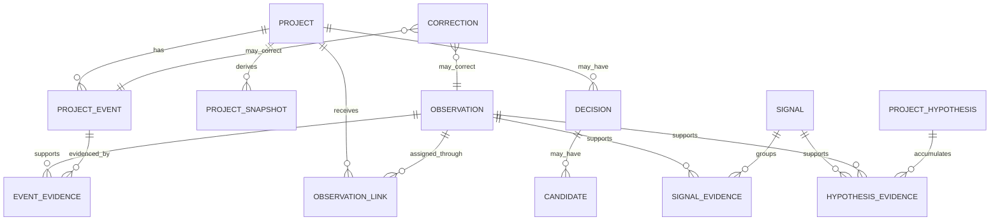

# Projects Community V2: Hermes-First Project Observatory

## Status

Approved product design for the V2 pivot.

This document supersedes the V1 product interaction model while preserving the
existing repository, Project records, and optional Decision research features.

## Product Vision

Projects Community V2 is a personal project observatory maintained primarily by
Hermes.

The user talks naturally with Hermes. Hermes identifies project-related facts,
changes, obstacles, decisions, and emerging themes, then records them through
structured tools. Projects Community turns those records into a trustworthy
view of the user's current project landscape.

The web application is not the primary place to create or edit project content.
It is a dashboard for answering:

1. What Projects exist now?
2. What changed recently?
3. What needs the user's attention or correction?
4. What possible new Projects are beginning to emerge?

The system must preserve why it believes something. Every derived Project
state, summary, and emerging-project hypothesis must remain traceable to
structured records, short source quotes, and Hermes conversation references.

## Product Repositioning

V1 is a conversation-first research workspace centered on Projects, Proposal
Decisions, Candidate branches, and an in-app Realizer.

V2 changes the primary interaction:

```text
V1: Web input -> in-app Realizer -> Project and Decision management

V2: Hermes conversations -> structured project events -> observational dashboard
```

The V2 product is:

- **Hermes-first:** Hermes is the main input and interpretation layer.
- **Event-first:** immutable observations and events are the source of truth.
- **Dashboard-oriented:** the web app prioritizes reading, statistics, and
  lightweight governance.
- **Explainable:** every inference includes evidence and can be corrected.
- **Project-centered:** Decisions remain useful but become optional structures
  inside Projects rather than the primary navigation model.

## Product Principles

- **Natural conversation is the input interface.** The user should not need to
  maintain Projects through forms or a document editor.
- **Record before deriving.** Hermes appends observations and events; the
  system derives current Project state from them.
- **Never hide uncertainty.** Uncertain assignment or interpretation enters a
  review queue instead of silently changing a Project.
- **History is immutable.** Corrections append new records and do not rewrite
  the original event.
- **Current state must be explainable.** Every displayed conclusion links back
  to evidence.
- **Dashboard actions are governance, not authorship.** The web app supports
  confirmation and correction but is not the main writing surface.
- **Potential Projects remain hypotheses.** Repeated signals may form a
  Project Hypothesis, but only the user promotes it to a formal Project.
- **Do not manufacture certainty.** V2 may show emerging themes but does not
  predict whether or when they will become Projects.
- **Local-first remains the default.** Projects Community stores its database
  locally and does not copy full Hermes conversations.

## Roles And Responsibilities

### Hermes

Hermes is the user's primary project-recording interface.

Hermes:

- detects project-relevant content during normal conversation;
- records structured Observations with concise summaries and short quotes;
- attaches high-confidence Observations to existing Projects;
- records Project Events when a meaningful change occurs;
- leaves uncertain assignments for user review;
- creates or updates Project Hypotheses when themes repeat;
- infers Project lifecycle state and records the evidence for that inference;
- suggests an optional Decision when a clear consequential trade-off appears;
- uses idempotency keys so retries do not duplicate records.

Hermes does not:

- directly overwrite a Project summary or lifecycle state;
- silently create a formal Project from an emerging theme;
- merge, archive, or delete Projects without user governance;
- copy full conversations into Projects Community;
- assign false probabilities or dates to Project Hypotheses.

### Projects Community

Projects Community is the durable project record and observation dashboard.

It:

- validates and stores Hermes submissions;
- maintains the immutable event history;
- derives current Project state and summaries;
- identifies records that need user attention;
- groups repeated signals into Project Hypotheses;
- exposes evidence and Hermes conversation references;
- lets the user perform lightweight governance;
- preserves V1 Projects and optional Decision data.

### User

The user talks to Hermes and governs the resulting project model.

The user:

- confirms or ignores uncertain Observations;
- corrects Project assignment and inferred lifecycle state;
- merges or archives Projects;
- promotes a Project Hypothesis into a formal Project;
- confirms the creation of optional Decisions;
- can trace any important conclusion back to its evidence.

## Capture Policy

V2 uses a mixed capture policy.

### High-Confidence Content

When Hermes is confident that content belongs to an existing Project, it may:

1. record an Observation;
2. attach the Observation to the Project;
3. record any meaningful Project Event derived from it.

Automatic assignment must include a confidence value and human-readable
rationale.

### Uncertain Content

When relevance or Project assignment is uncertain, Hermes records a candidate
Observation without changing a Project. It appears in `Needs Attention` for the
user to confirm, reassign, or ignore.

### Emerging Themes

When a theme recurs without clearly belonging to an existing Project, Hermes
creates or updates a Project Hypothesis. A hypothesis accumulates supporting
Observations and Signals over time. It does not become a formal Project until
the user explicitly promotes it.

## Core Concepts

### Observation

An `Observation` is a structured, immutable record extracted by Hermes from a
conversation.

It contains:

- concise structured summary;
- observation type;
- necessary short source quote;
- Hermes conversation and message reference;
- observed and recorded timestamps;
- proposed Project assignment, when present;
- assignment confidence and rationale;
- review status;
- idempotency key;
- Hermes/tool schema version.

Observation types include:

- `progress`;
- `idea`;
- `interest`;
- `obstacle`;
- `question`;
- `commitment`;
- `decision_signal`;
- `project_signal`;
- `context`;
- `other`.

The original full conversation remains in Hermes.

### Project Event

A `ProjectEvent` is an immutable statement that something meaningful happened
to a Project.

Event types include:

- `project_created`;
- `observation_attached`;
- `progress_recorded`;
- `direction_changed`;
- `obstacle_identified`;
- `obstacle_resolved`;
- `interest_increased`;
- `interest_decreased`;
- `lifecycle_inferred`;
- `lifecycle_corrected`;
- `project_merged`;
- `project_archived`;
- `hypothesis_promoted`;
- `legacy_imported`;
- `decision_suggested`;
- `decision_confirmed`.

Each event includes its evidence references, actor, timestamp, payload schema
version, and idempotency key when created by Hermes.

### Project

A `Project` is a formal, durable identity for an ongoing body of intent,
exploration, or work.

The Project record stores stable identity fields. Its current summary,
lifecycle state, recent changes, obstacles, and other dashboard-facing fields
are projections derived from events.

Project lifecycle states are:

- `active`;
- `dormant`;
- `ended`;
- `archived`.

Hermes may infer these states automatically. The dashboard must show the basis
for the inference and allow the user to correct it. A correction has display
precedence until newer explicit evidence supports a later transition.

### Project Snapshot

A `ProjectSnapshot` is a versioned, derived representation of a Project at a
point in time.

It contains:

- current summary;
- lifecycle state;
- active themes;
- current obstacles;
- unresolved questions;
- recent changes;
- source event boundary;
- generation timestamp and projection version.

Snapshots improve read performance and make state evolution easy to review.
They are rebuildable from the event history.

### Signal

A `Signal` groups repeated or related Observations into a meaningful theme.

Signals may describe:

- recurring interests;
- repeated obstacles;
- unmet needs;
- repeated questions;
- opportunities spanning Projects;
- possible new project directions.

A Signal always exposes its supporting Observations. It is evidence grouping,
not a prediction.

### Project Hypothesis

A `ProjectHypothesis` represents a possible Project that is beginning to
emerge.

It contains:

- working title;
- concise explanation of the possible Project;
- supporting Signals and Observations;
- first-seen and last-seen timestamps;
- current status;
- promotion or rejection history.

Hypothesis states are:

- `emerging`;
- `promoted`;
- `dismissed`;

V2 does not assign a formation probability or predicted formation date.

### Correction

A `Correction` records a user governance action that changes how existing
evidence should be interpreted.

Corrections include:

- confirm Observation;
- ignore Observation;
- change Project assignment;
- correct lifecycle state;
- merge Projects;
- archive Project;
- promote or dismiss Project Hypothesis.

Corrections never delete the original Observation or Event.

### Optional Decision Structures

Existing `Decision`, `Candidate`, `Recommendation`, and `AdoptionSnapshot`
records remain available inside a Project.

They are no longer a default top-level workflow. Hermes suggests a Decision
only when it identifies a clear consequential trade-off, and creation requires
user confirmation.

## Hermes Tool Contract

Projects Community exposes a small structured tool surface to Hermes. MCP is
the preferred transport. An HTTP adapter may expose the same application
service contract.

### `record_observation`

Records a structured Observation.

Required input:

- `idempotencyKey`;
- `summary`;
- `type`;
- `observedAt`;
- `sourceConversationRef`;
- `sourceMessageRef`;
- `sourceQuote`;
- optional proposed `projectId`;
- optional assignment confidence and rationale.

Result:

- Observation identifier;
- accepted review status;
- attached Project identifier, when automatically assigned;
- whether the call was deduplicated.

### `attach_observation_to_project`

Attaches a previously unassigned Observation to an existing Project.

This tool is intended for a later high-confidence Hermes conclusion or a
user-confirmed Hermes action. It records an attachment event rather than
mutating the Observation.

### `record_project_event`

Records a meaningful change for an existing Project.

Required input:

- `idempotencyKey`;
- `projectId`;
- event type;
- structured payload;
- evidence Observation identifiers;
- rationale.

### `upsert_project_hypothesis`

Creates or adds evidence to a Project Hypothesis.

Hermes supplies a stable hypothesis key, working title, explanation, and
supporting Observation or Signal identifiers. It cannot promote the hypothesis
to a formal Project.

### `suggest_decision`

Records a suggested optional Decision attached to a Project. The suggestion
remains pending until the user confirms it.

### Tool Rules

- Every Hermes write includes an idempotency key.
- Tools return structured validation errors and never partially write.
- Assignment confidence is a calibrated input, not a displayed probability of
  truth.
- A low-confidence Observation remains unassigned.
- Tools record actor and schema version for future migrations.
- Hermes cannot directly call destructive Project operations.

## Data Flow

```text
User talks with Hermes
        |
        v
Hermes identifies project-relevant information
        |
        v
Projects Community MCP/API Adapter
        |
        v
Ingestion Service
  - validates schema
  - checks idempotency
  - applies assignment policy
  - appends records transactionally
        |
        v
Event Store
  - Observations
  - Project Events
  - Corrections
  - Hypothesis evidence
        |
        v
Projection Engine
  - Project current state
  - Project snapshots
  - attention queue
  - recent changes
  - dashboard metrics
        |
        v
Dashboard Read Models
```

## Dashboard Information Architecture

The web application is primarily observational. It does not provide a general
Project content editor.

### Home: Current Projects

The home page first answers "What exists now?"

It shows:

- active Projects;
- dormant Projects;
- recently ended or archived Projects;
- concise current summaries;
- latest meaningful change;
- current obstacles or unresolved questions;
- lifecycle inference basis;
- counts of items needing attention.

### Needs Attention

This view contains:

- unassigned candidate Observations;
- low-confidence Project assignments;
- conflicting interpretations;
- pending Decision suggestions;
- governance actions requiring confirmation.

Available actions:

- confirm;
- ignore;
- assign or reassign;
- correct inferred state;
- merge;
- archive;
- promote or dismiss a Project Hypothesis.

Each action appends a Correction or governance event.

### Recent Changes

This view provides a chronological stream of meaningful Project Events,
including progress, new obstacles, direction changes, lifecycle transitions,
merges, and promotions.

### Project Hypotheses

This view shows emerging possible Projects with:

- working title and explanation;
- supporting Signals and Observations;
- first-seen and last-seen timestamps;
- recent supporting evidence;
- promote and dismiss actions.

It does not display a probability or predicted start date.

### Project Detail

A Project detail view shows:

- current Project Snapshot;
- evidence-backed event timeline;
- linked Observations and short quotes;
- lifecycle history and inference basis;
- current obstacles, questions, and themes;
- optional Decisions;
- related Projects and Signals;
- Hermes conversation deep links when available.

### Secondary Views

Secondary views may include:

- cross-Project themes and Signals;
- activity trends;
- optional Decision research;
- Community Map.

The Community Map is not a V2 launch blocker. When updated, it should visualize
activity, relationships, and emerging Project Hypotheses rather than only
adopted Decision counts.

## Technical Architecture

V2 remains in the current repository and retains the existing stack:

- Next.js and TypeScript;
- SQLite and Drizzle ORM;
- local-first storage;
- existing Project and optional Decision data.

New architectural boundaries:

### MCP/API Adapter

Exposes the Hermes tool contract. MCP is the preferred Hermes integration.
HTTP may be supported as a transport adapter over the same application
services.

### Ingestion Service

Owns:

- schema validation;
- idempotency checks;
- actor and source metadata;
- automatic-assignment policy;
- transactional event appends;
- structured tool responses.

It does not derive dashboard state directly.

### Event Store

Stores immutable Observations, Project Events, Corrections, Signal evidence,
and Project Hypothesis evidence.

The event store is the source of truth for V2-derived state.

### Projection Engine

Consumes events and produces rebuildable read models.

Synchronous projections update the affected Project and attention queue after
ingestion. Larger cross-Project analytics may rebuild asynchronously.

Every projection records:

- last processed event;
- projection schema version;
- generation time;
- failure status.

### Read Models

Read models provide efficient queries for:

- Current Projects;
- Needs Attention;
- Recent Changes;
- Project Hypotheses;
- Project details;
- future trend and relationship views.

## Conceptual Data Model



Exact table design belongs in the implementation plan. The implementation must
preserve immutable evidence relationships and rebuildable projections.

## V1 Migration Strategy

V2 is a pivot of the existing product, not a new project or repository.

Migration rules:

- Keep existing `projects` records as formal Project identities.
- Keep `decisions`, `candidates`, `recommendations`, and
  `adoption_snapshots` as optional Project structures.
- Create one `legacy_imported` event per existing Project to establish the V2
  event history boundary.
- Preserve existing Project summaries as legacy evidence; later V2 snapshots
  are derived from new events.
- Keep existing web creation and editing paths temporarily for migration and
  debugging, but remove them from the primary navigation as V2 matures.
- Do not delete V1 data during the initial V2 migration.
- Do not make Community Map redesign a prerequisite for the Hermes ingestion
  loop or dashboard launch.

## Reliability And Error Handling

- Hermes retries with the same idempotency key return the original result and
  do not duplicate records.
- An ingestion transaction writes the Observation/Event and all required
  evidence links atomically.
- Projection failure never loses accepted source records.
- Projections can be rebuilt from the event store.
- Unrecognized or uncertain Project assignment preserves the Observation and
  sends it to `Needs Attention`.
- Invalid Hermes input returns a structured error with no partial write.
- Broken Hermes deep links do not make stored summaries and short quotes
  unreadable.
- User Corrections remain visible and take precedence in current projections.
- Merge and archive operations preserve all original Project histories.
- Full Hermes conversation content is never required for a projection rebuild.

## Privacy And Data Boundaries

Projects Community stores only the project-relevant structured record needed
for its purpose:

- structured summary;
- necessary short quote;
- Hermes conversation and message reference;
- timestamps and attribution;
- Project assignment rationale and evidence.

It does not copy full Hermes conversations. A user can understand the Project
record without opening Hermes, while the source reference supports deeper
review when available.

## V2 MVP Scope

The V2 MVP must support:

1. real Hermes tool calls through the MCP or shared application-service
   contract;
2. idempotent structured Observation ingestion;
3. automatic high-confidence assignment to an existing Project;
4. a review queue for uncertain or unassigned Observations;
5. immutable Project Events with evidence links;
6. automatic Project lifecycle inference with displayed rationale;
7. user Correction of assignment and lifecycle inference;
8. current Project state and summary projections;
9. a Dashboard home view for Current Projects, Needs Attention, and Recent
   Changes;
10. Project Hypothesis creation and evidence accumulation;
11. user promotion or dismissal of a Project Hypothesis;
12. Project detail timelines with short quotes and Hermes references;
13. import boundaries for existing V1 Projects;
14. continued access to optional V1 Decision data;
15. projection rebuild from event history.

The V2 MVP does not include:

- scanning all Hermes conversations as a fallback ingestion mechanism;
- copying complete Hermes conversations;
- a general Project document editor;
- probability or time prediction for future Projects;
- autonomous formal Project creation;
- autonomous Project merge, archive, or deletion;
- mandatory Community Map redesign;
- multi-user collaboration;
- cross-device synchronization;
- a general-purpose personal knowledge graph;
- scheduled autonomous research.

## Verification Strategy

### Tool And Ingestion Verification

Automated tests must verify:

- valid Hermes tool payloads create the expected records;
- repeated idempotency keys do not duplicate records;
- invalid payloads do not partially write;
- high-confidence assignment attaches to a Project;
- low-confidence assignment enters the review queue;
- evidence links remain intact.

### Projection Verification

Automated tests must verify:

- Project current state derives from its events;
- user Corrections override earlier automatic inference;
- later explicit evidence can produce a new lifecycle transition;
- projection rebuild produces the same current state;
- projection failure preserves source events;
- merged and archived Projects retain their history.

### Dashboard Verification

End-to-end tests must verify:

1. Hermes records a high-confidence Observation for an existing Project.
2. The Dashboard shows the resulting Project change.
3. Hermes records an uncertain Observation.
4. The Observation appears in `Needs Attention`.
5. The user assigns it to a Project.
6. The Project projection and timeline update through an appended Correction.
7. Repeated Signals create or update a Project Hypothesis.
8. The user promotes the hypothesis into a formal Project.
9. The new Project preserves all hypothesis evidence.
10. Every displayed conclusion links to its short quote and Hermes reference.

### Migration Verification

Tests must verify:

- existing V1 Projects remain accessible;
- each migrated Project receives a single idempotent `legacy_imported` event;
- existing optional Decision data remains linked and readable;
- V2 projections do not rewrite or delete V1 records.

## V2 Completion Criteria

V2 is complete when:

1. Hermes can use the real structured tools to record project information.
2. Clear project content automatically updates the correct Project through
   events and projections.
3. Uncertain content is visible and governable in the Dashboard.
4. The Dashboard first answers what Projects exist now and what needs
   attention.
5. Repeated emerging themes form evidence-backed Project Hypotheses.
6. The user can correct Hermes without editing or deleting history.
7. Every important Project conclusion is explainable from stored evidence.
8. Duplicate Hermes submissions are harmless.
9. Read models can be rebuilt from the event history.
10. Existing V1 Projects and optional Decision structures continue to work.

## Future Directions

After the V2 MVP proves the Hermes-to-Dashboard loop, later work may add:

- richer cross-Project relationship and trend analysis;
- improved Signal clustering;
- Community Map visualization of active, dormant, and emerging Projects;
- scheduled project reviews initiated through Hermes;
- additional trusted ingestion agents;
- encrypted cross-device synchronization;
- explicitly requested forecasts grounded in accumulated history.

These directions must not weaken the event history, evidence traceability, or
user governance model established by V2.
